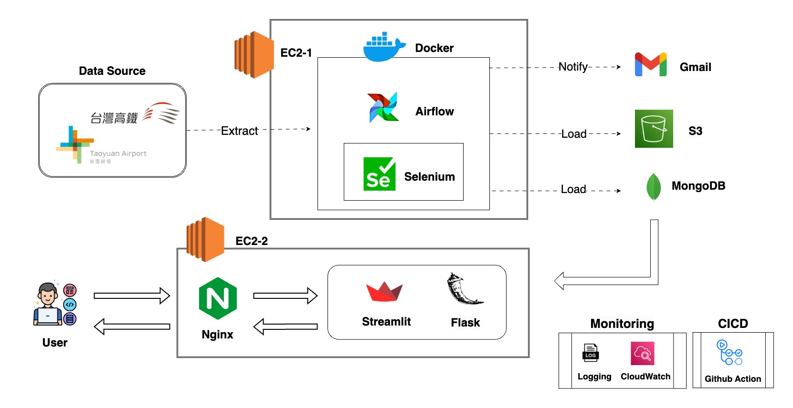

# Flying High

A system to notify passengers of flight changes, verify delay compensations, and compare airline punctuality
to aid in informed ticket purchasing decisions

## Demo Link

Access my site at https://www.flyinghigh.live/

## Table of Content

- [Flying High](#flying-high)
  - [Demo Link](#demo-link)
  - [Table of Contents](#table-of-contents)
  - [System Architecture](#system-architecture)
    - [Architecture Diagram](#architecture-diagram)
    - [Simple Introduction of Architecture](#simple-introduction-of-architecture)
  - [Feature](#feature)
    - [Infrastructure](#infrastructure)
    - [Website](#website)
  - [Demo](#demo-1)
  - [Technologies](#technologies)
  - [Deployment](#deployment)
  - [Contact](#contact)

## System Architecture

### Architecture diagram

### Simple introdction of architecture

#### Containerization

- Deployed the Airflow environment within Docker containers to ensure consistency and isolation across different systems.

#### ETL

- Extracted flight information from Taoyuan Airport with the Selenium package hosted on AWS EC2 with Ubuntu Server.
- Transformed data to Json format.
- Loaded parsed and clean data to MongoDB for real-time access.

#### Server

- Utilized two framework and deployed Flask application and Streamlit in AWS EC2 with Amazon Linux Server and configured Nginx as reverse proxy.

#### Database

- Stored all data in MongoDB on the purpose of flexible schema which makes the data stored rapidly and easily whenever data resource changed.

#### Backup

- Utilized AWS S3 to back up flight data concurrently for persistence and safety.

## Feature

### Infrastructure

- Data Pipeline

  - Extract
    1. Crawled data from Taoyuan airport website by crawling package, Selenium
    2. Fetch the high-speed train timetable by POST API
  - Transform
    1. Crawled data will be parsed and tranformed to a JSON structure
  - Load
    1. Load into MongoDB for storing and AWS S3 bucket for back up.
    2. Update collection of flight departure and arrival times to avoid duplicate data.
  - Containerization & Scheduling
    1. Utilized docker-compose to set up Airflow on the first AWS EC2 Ubuntu instance, to ensure consistency and isolation across different systems
    2. Notify registered users with information about available high-speed train services every day at midnight.
    3. Search MongoDB for users who have registered to receive email notifications every 20 minutes. If there are any delays or changes to their flights, users are notified via the Gmail SMTP service.
    4. Aggregate and transform flight data from MongoDB to create flight maps everyday

- Database: Store all data in MongoDB on the purpose of flexible schema which makes the data stored rapidly and easily whenever data resource changed.

- Servers: Deploy website by Flask and Streamlit framework on second Amazon EC2.

- Maintenance

  - Monitoring
    - CloudWatch tracks logs and infrastructure-related metrics from servers
  - Unit tests and Integration tests
    - Implemented unit and integration tests to validate data transformation accuracy, and utilized GitHub Actions for continuous deployment, reducing the potential for human errors.

- CI/CD: Established a CI/CD pipeline using GitHub Actions to build and test code every time pushing a commit to
  GitHub, which can save a lot of time and effort.

### Website

- Flight Finder: Streamline your travel planning with our intuitive search feature, complete with an auto-complete dropdown menu. Find specific departure or arrival flights in real-time, ensuring you're always one step ahead.

- Insurance Solutions: Quickly access potential insured amounts varying by different insurers.

- Real-Time Flight Alerts: Stay informed and never miss a beat with automated email notifications. Any changes to your flight are immediately communicated, keeping user updated and prepared.

- Personalized Insurance Insights: Easily retrieve detailed insurance information relevant to your profile.

- Interactive Flight Map: View all flights departing from or arriving at Taoyuan Airport each day, offering user a comprehensive overview of travel options.

- Airline Performance Metrics: Gain insight into airline reliability with on-time performance tracker. Compare and contrast the punctuality of different carriers, empowering you with the knowledge to choose the best airline for your travels.

## Demo

### Flight Finder & Insurance Solutions

### Personalized Insurance Insights

### Interactive Flight Map

### Airline Performance Metrics

## Technologies

- Programming: Python, HTML, CSS/Bootstrap, JavaScript
- Frameworks: Flask, Streamlit
- Database: MongoDB
- Tools: Airflow, Docker
- Cloud Engineering - AWS: EC2, CloudWatch, S3, Route53
- Automation: GitHub Actions

## Contact

Lily Chou - lily28252005@gmail.com
